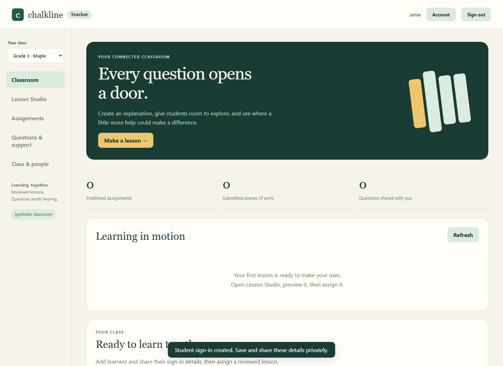
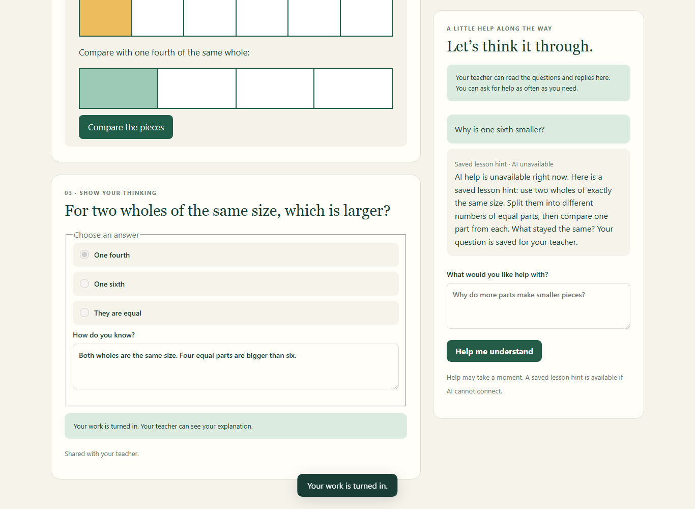

# Onyx Chalkline

Chalkline is a teacher-led AI classroom app with a Hermes-based desktop that helps teachers turn lesson ideas into interactive HTML activities, custom narrated videos, and assigned practice. Teachers review and publish lessons, while students use a connected workspace to explore explanations, ask lesson-specific AI questions, complete work, and receive feedback. Teachers can review those questions and replies alongside student submissions to plan follow-up instruction around where learners need support. The current release is a working local prototype using synthetic Grade 3 fractions data; school accounts and deployment across student devices are planned next.

Two runnable prototypes live here:

| App | What it does | Start |
| --- | --- | --- |
| **Connected classroom** | Teacher Lesson Studio, interactive fraction lessons, narrated videos, student assignments and AI help, teacher question review and feedback | `cd classroom && node server.mjs` |
| **Teacher evidence workspace** | Synthetic evidence groups, local observations, lesson planning and CSV/JSON handoffs | `npm ci && npm run dev` |

**Current scope: synthetic demonstration data only.** The connected classroom has one teacher and four fictional learners, runs on one computer, and currently teaches Grade 3 unit fractions. Real student accounts and school-device distribution are future work.

## Connected teacher and student workflow

1. Edit a lesson, quiz and narration script, or ask your configured model to draft a new theme.
2. Preview the interactive HTML lesson. On Windows, render a narrated MP4 with captions and a transcript.
3. Review the saved version, choose learners, a due date and the allowed help level, then assign it.
4. Students open their individual demo links, explore the lesson, ask for help, save work and submit answers.
5. Teachers review exact questions and replies, work and submissions, send feedback, and draft follow-up teaching.

Published lessons are immutable snapshots. Private teacher notes and answer keys stay out of student APIs and model context. Students can see that their teacher receives lesson questions. Topic grouping uses simple keyword rules; it does not diagnose or grade children.





### Try it

Requires Node.js 22.16+ (Node 24 recommended). No dependency installation is needed to run the classroom:

```sh
git clone https://github.com/lEWFkRAD/onyx-chalkline.git
cd onyx-chalkline/classroom
node server.mjs
```

Open the private `teacherUrl` in the generated `classroom/data/launch.json`. Windows users can instead run `./Start-Classroom.ps1` from the classroom directory. Get each student's link from the teacher view. These links work only on the same computer.

See the **[classroom setup and operating guide](classroom/README.md)** for optional AI configuration, Windows narration requirements, tests, access boundaries and limitations. Keep generated access links, databases, provider credentials and configuration private.

## Hermes desktop edition

The teacher desktop has been brought to Hermes upstream snapshot `16bc0b6b94be7435cb63ed30923fbc7edd53f4c5` and includes a Connected classroom tab. Its separate app identity and `chalkline://` links are preserved.

[Native Chalkline source and build guide](https://github.com/lEWFkRAD/hermes-agent/blob/codex/chalkline-public-20261003/CHALKLINE.md) lives on a dedicated branch of the user-owned Hermes fork. The classroom service in this repository can also run independently of Hermes. No prebuilt desktop installer is included in this update.

## Existing teacher evidence workspace

The original web app remains at the repository root. It includes Today, Plan, Evidence, Students and Integrations views with synthetic Grade 3 mathematics data. Observations are stored in the browser; roster CSV parsing does not replace the displayed demo roster. CSV evidence and lesson JSON are local exports.

```sh
npm ci
npm run dev
npm test
npm run lint
```

The workspace requires Node 22.13+. The connected classroom is a separate application and data store; it does not yet synchronize with the original evidence demo.

## Integration starter pack

Canvas, Clever and ClassLink connectors have mock-backed contract tests. Infinite Campus and OneRoster use CSV/file handoffs. They are not wired to a live district tenant. See the [integration matrix](docs/NWGA-INTEGRATION-MATRIX.md) for capabilities and setup assumptions. Vendor and district names do not imply endorsement or authorization.

## Before a school pilot

Cross-device hosting, district identity, class/tenant authorization, retention/deletion, encrypted operations, accessibility and model/pedagogical evaluation remain necessary. This prototype is not approved for real student records. Teacher-controlled review remains central to the workflow.

## License

Licensed under [Apache-2.0](LICENSE). The separate Hermes-derived native repository retains its own upstream license and notices.
