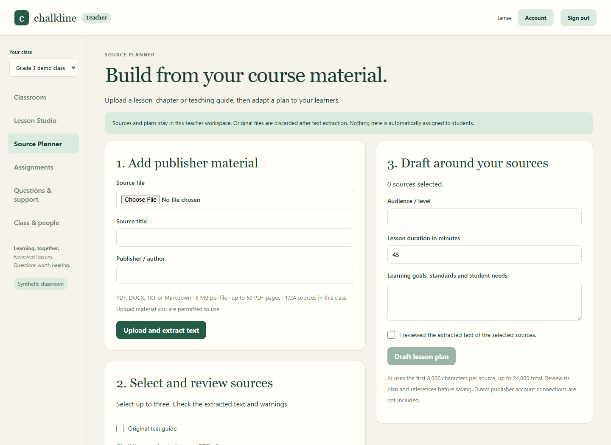
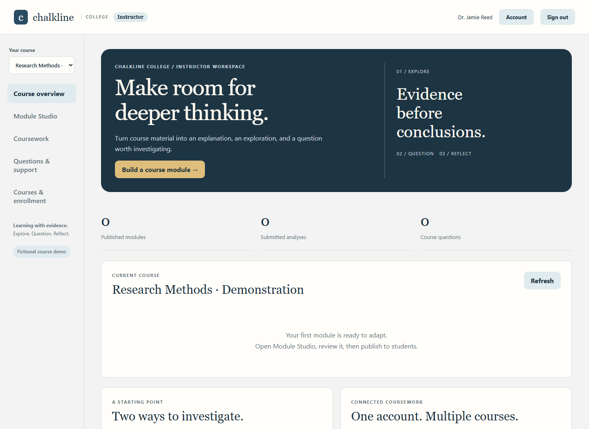
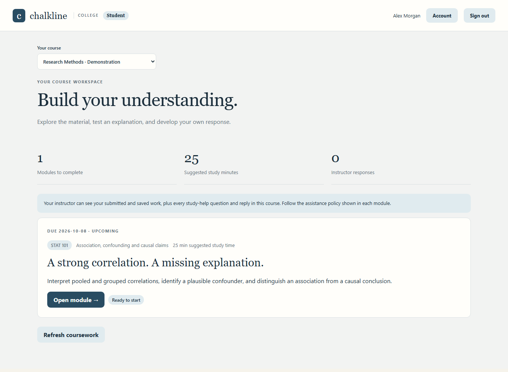

# Onyx Chalkline

Chalkline is a teacher-led AI classroom app with a Hermes-based desktop that helps teachers turn lesson ideas into interactive HTML activities, custom narrated videos, and assigned practice. Teachers review and publish lessons, while students use a connected workspace to explore explanations, ask lesson-specific AI questions, complete work, and receive feedback. Teachers can review those questions and replies alongside student submissions to plan follow-up instruction around where learners need support. The connected service supports individual sign-ins, teacher-owned classes, student enrollment, private HTTPS access across devices, and recoverable work with safe retries. Version 0.3 adds Chalkline College: separate course accounts, interactive statistics and close-reading modules, instructor-supplied readings, narrated explanations, and written analysis. Version 0.4 adds a private Source Planner in both editions: import PDF, Word or text teaching material, review the extraction, and draft an editable lesson plan with page/section references, pacing, differentiation, assessment and homework. Both editions use fictional demonstration data; school and university pilots remain future stages.

Runnable workspaces:

| App | What it does | Start |
| --- | --- | --- |
| **Connected classroom** | Teacher Lesson Studio, interactive fraction lessons, narrated videos, student assignments and AI help, teacher question review and feedback | [Setup](classroom/README.md) |
| **Chalkline College** | Course modules, statistics lab, close reading, source excerpts, analysis and instructor feedback | [College setup and launcher](classroom/COLLEGE.md) |
| **Teacher evidence workspace** | Synthetic evidence groups, local observations, lesson planning and CSV/JSON handoffs | `npm ci && npm run dev` |

**Current scope: synthetic demonstration data only.** The connected classroom starts with a teacher and four fictional learners. Teachers can create additional classes and student accounts, and an operator can add teachers. Private device access is supported; real pupil records, district identity and a school rollout remain outside this release.

## Connected teacher and student workflow

1. Edit a lesson, quiz and narration script, or ask your configured model to draft a new theme.
2. Preview the interactive HTML lesson. On Windows, render a narrated MP4 with captions and a transcript.
3. Review the saved version, choose learners, a due date and the allowed help level, then assign it.
4. Students sign in with their individual accounts, explore the lesson, ask for help, save work and submit answers.
5. Teachers review exact questions and replies, work and submissions, send feedback, and draft follow-up teaching.

Published lessons are immutable snapshots. Private teacher notes and answer keys stay out of student APIs and model context. Students can see that their teacher receives lesson questions. Topic grouping uses simple keyword rules; it does not diagnose or grade children.


### Try it

Requires Node.js 24.11+ (Node 24 recommended). Install the pinned document parsers before starting:

```sh
git clone https://github.com/lEWFkRAD/onyx-chalkline.git
cd onyx-chalkline/classroom
npm ci --omit=dev --ignore-scripts --workspaces=false
node server.mjs
```

Open `http://127.0.0.1:5195` and use the initial teacher credentials in the private `classroom/data/bootstrap.json`. Windows users can run `./Start-Classroom.ps1`. Add learners in **Class & people** and share their generated credentials privately. For access from other devices, configure your private HTTPS origin using the setup guide.

See the **[classroom setup and operating guide](classroom/README.md)** for optional AI configuration, Windows narration requirements, tests, access boundaries and limitations. Keep generated credentials, session links, databases and provider configuration private. Offline backup, validation, restoration and teacher account recovery are documented in the operating guide.

## Plan around publisher material

Open **Source Planner** to upload a lesson, chapter or guide you are permitted to use, including files from resources such as McGraw Hill. Review extracted text, select sources, describe the learners and goals, then draft and edit a private teaching plan. Source references, timed steps, differentiation, assessment and homework remain editable. Save or download the plan; source documents are not automatically assigned to students. This release supports file uploads rather than publisher account connections.



See [supported formats, teacher workflow and limits](classroom/SOURCE-PLANNER.md).

## Chalkline College

The college edition uses a separate navy-and-ivory instructor/student workspace and separate accounts and data. Start with a correlation-and-causation lab or an academic reading seminar, then adapt explanations, readings and assessments. Students can join multiple courses owned by the same instructor, save analysis, ask course-specific questions and receive feedback.





See [college setup, walkthrough and limits](classroom/COLLEGE.md). The existing Grade 3 edition and native desktop remain available.

## Hermes desktop edition

The teacher desktop has been brought to Hermes upstream snapshot `16bc0b6b94be7435cb63ed30923fbc7edd53f4c5` and includes a Connected classroom tab. Its separate app identity and `chalkline://` links are preserved.

[Native Chalkline source and build guide](https://github.com/lEWFkRAD/hermes-agent/blob/codex/chalkline-public-20261003/CHALKLINE.md) lives on a dedicated branch of the user-owned Hermes fork. The classroom service in this repository can also run independently of Hermes. No prebuilt desktop installer is included in this update.

## Existing teacher evidence workspace

The original web app remains at the repository root. It includes Today, Plan, Evidence, Students and Integrations views with synthetic Grade 3 mathematics data. Observations are stored in the browser; roster CSV parsing does not replace the displayed demo roster. CSV evidence and lesson JSON are local exports.

```sh
npm ci
npm run dev
npm test
npm run lint
```

The workspace requires Node 22.13+. The connected classroom is a separate application and data store; it does not yet synchronize with the original evidence demo.

## Integration starter pack

Canvas, Clever and ClassLink connectors have mock-backed contract tests. Infinite Campus and OneRoster use CSV/file handoffs. They are not wired to a live district tenant. See the [integration matrix](docs/NWGA-INTEGRATION-MATRIX.md) for capabilities and setup assumptions. Vendor and district names do not imply endorsement or authorization.

See [the staged roadmap](docs/ROADMAP.md) for what this release completes and what comes next.

## Before a school pilot

The private demo includes class authorization, expiring sessions, password resets and offline recovery. District identity, retention/deletion, operational monitoring, accessibility and model/pedagogical evaluation still need school-specific implementation and validation. This prototype is not approved for real student records. Teacher-controlled review remains central to the workflow.

## License

Licensed under [Apache-2.0](LICENSE). The separate Hermes-derived native repository retains its own upstream license and notices.
